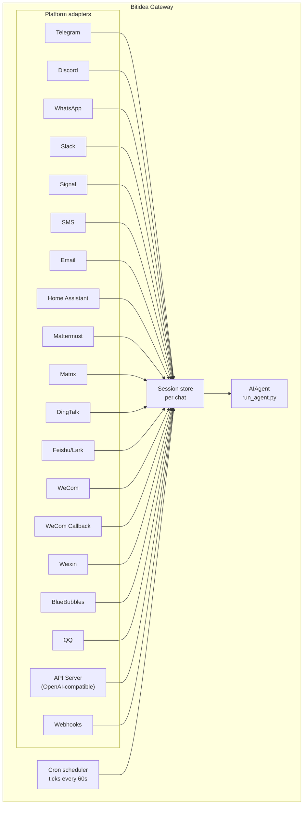

# Messaging Gateway

Chat with Bitidea from Telegram, Discord, Slack, WhatsApp, Signal, SMS, Email, Home Assistant, Mattermost, Matrix, DingTalk, Feishu/Lark, WeCom, Weixin, BlueBubbles (iMessage), QQ, or your browser. The gateway is a single background process that connects to all your configured platforms, handles sessions, runs cron jobs, and delivers voice messages.

For the full voice feature set — including CLI microphone mode, spoken replies in messaging, and Discord voice-channel conversations — see [Voice Mode](/docs/user-guide/features/voice-mode) and [Use Voice Mode with Bitidea](/docs/guides/use-voice-mode-with-bitidea).

## Platform Comparison

| Platform | Voice | Images | Files | Threads | Reactions | Typing | Streaming |
|----------|:-----:|:------:|:-----:|:-------:|:---------:|:------:|:---------:|
| Telegram | ✅ | ✅ | ✅ | ✅ | — | ✅ | ✅ |
| Discord | ✅ | ✅ | ✅ | ✅ | ✅ | ✅ | ✅ |
| Slack | ✅ | ✅ | ✅ | ✅ | ✅ | ✅ | ✅ |
| WhatsApp | — | ✅ | ✅ | — | — | ✅ | ✅ |
| Signal | — | ✅ | ✅ | — | — | ✅ | ✅ |
| SMS | — | — | — | — | — | — | — |
| Email | — | ✅ | ✅ | ✅ | — | — | — |
| Home Assistant | — | — | — | — | — | — | — |
| Mattermost | ✅ | ✅ | ✅ | ✅ | — | ✅ | ✅ |
| Matrix | ✅ | ✅ | ✅ | ✅ | ✅ | ✅ | ✅ |
| DingTalk | — | — | — | — | — | ✅ | ✅ |
| Feishu/Lark | ✅ | ✅ | ✅ | ✅ | ✅ | ✅ | ✅ |
| WeCom | ✅ | ✅ | ✅ | — | — | ✅ | ✅ |
| WeCom Callback | — | — | — | — | — | — | — |
| Weixin | ✅ | ✅ | ✅ | — | — | ✅ | ✅ |
| BlueBubbles | — | ✅ | ✅ | — | ✅ | ✅ | — |
| QQ | ✅ | ✅ | ✅ | — | — | ✅ | — |

**Voice** = TTS audio replies and/or voice message transcription. **Images** = send/receive images. **Files** = send/receive file attachments. **Threads** = threaded conversations. **Reactions** = emoji reactions on messages. **Typing** = typing indicator while processing. **Streaming** = progressive message updates via editing.

## Architecture



Each platform adapter receives messages, routes them through a per-chat session store, and dispatches them to the AIAgent for processing. The gateway also runs the cron scheduler, ticking every 60 seconds to execute any due jobs.

## Quick Setup

The easiest way to configure messaging platforms is the interactive wizard:

```bash
bitidea gateway setup        # Interactive setup for all messaging platforms
```

This walks you through configuring each platform with arrow-key selection, shows which platforms are already configured, and offers to start/restart the gateway when done.

## Gateway Commands

```bash
bitidea gateway              # Run in foreground
bitidea gateway setup        # Configure messaging platforms interactively
bitidea gateway install      # Install as a user service (Linux) / launchd service (macOS)
sudo bitidea gateway install --system   # Linux only: install a boot-time system service
bitidea gateway start        # Start the default service
bitidea gateway stop         # Stop the default service
bitidea gateway status       # Check default service status
bitidea gateway status --system         # Linux only: inspect the system service explicitly
```

## Chat Commands (Inside Messaging)

| Command | Description |
|---------|-------------|
| `/new` or `/reset` | Start a fresh conversation |
| `/model [provider:model]` | Show or change the model (supports `provider:model` syntax) |
| `/provider` | Show available providers with auth status |
| `/personality [name]` | Set a personality |
| `/retry` | Retry the last message |
| `/undo` | Remove the last exchange |
| `/status` | Show session info |
| `/stop` | Stop the running agent |
| `/approve` | Approve a pending dangerous command |
| `/deny` | Reject a pending dangerous command |
| `/sethome` | Set this chat as the home channel |
| `/compress` | Manually compress conversation context |
| `/title [name]` | Set or show the session title |
| `/resume [name]` | Resume a previously named session |
| `/usage` | Show token usage for this session |
| `/insights [days]` | Show usage insights and analytics |
| `/reasoning [level\|show\|hide]` | Change reasoning effort or toggle reasoning display |
| `/voice [on\|off\|tts\|join\|leave\|status]` | Control messaging voice replies and Discord voice-channel behavior |
| `/rollback [number]` | List or restore filesystem checkpoints |
| `/background <prompt>` | Run a prompt in a separate background session |
| `/reload-mcp` | Reload MCP servers from config |
| `/update` | Update Bitidea Agent to the latest version |
| `/help` | Show available commands |
| `/<skill-name>` | Invoke any installed skill |

## Session Management

### Session Persistence

Sessions persist across messages until they reset. The agent remembers your conversation context.

### Reset Policies

Sessions reset based on configurable policies:

| Policy | Default | Description |
|--------|---------|-------------|
| Daily | 4:00 AM | Reset at a specific hour each day |
| Idle | 1440 min | Reset after N minutes of inactivity |
| Both | (combined) | Whichever triggers first |

Configure per-platform overrides in `~/.bitidea/gateway.json`:

```json
{
  "reset_by_platform": {
    "telegram": { "mode": "idle", "idle_minutes": 240 },
    "discord": { "mode": "idle", "idle_minutes": 60 }
  }
}
```

## Security

**By default, the gateway denies all users who are not in an allowlist or paired via DM.** This is the safe default for a bot with terminal access.

```bash
# Restrict to specific users (recommended):
TELEGRAM_ALLOWED_USERS=123456789,987654321
DISCORD_ALLOWED_USERS=123456789012345678
SIGNAL_ALLOWED_USERS=+155****4567,+155****6543
SMS_ALLOWED_USERS=+155****4567,+155****6543
EMAIL_ALLOWED_USERS=trusted@example.com,colleague@work.com
MATTERMOST_ALLOWED_USERS=3uo8dkh1p7g1mfk49ear5fzs5c
MATRIX_ALLOWED_USERS=@alice:matrix.org
DINGTALK_ALLOWED_USERS=user-id-1
FEISHU_ALLOWED_USERS=ou_xxxxxxxx,ou_yyyyyyyy
WECOM_ALLOWED_USERS=user-id-1,user-id-2
WECOM_CALLBACK_ALLOWED_USERS=user-id-1,user-id-2

# Or allow
GATEWAY_ALLOWED_USERS=123456789,987654321

# Or explicitly allow all users (NOT recommended for bots with terminal access):
GATEWAY_ALLOW_ALL_USERS=true
```

### DM Pairing (Alternative to Allowlists)

Instead of manually configuring user IDs, unknown users receive a one-time pairing code when they DM the bot:

```bash
# The user sees: "Pairing code: XKGH5N7P"
# You approve them with:
bitidea pairing approve telegram XKGH5N7P

# Other pairing commands:
bitidea pairing list          # View pending + approved users
bitidea pairing revoke telegram 123456789  # Remove access
```

Pairing codes expire after 1 hour, are rate-limited, and use cryptographic randomness.

## Interrupting the Agent

Send any message while the agent is working to interrupt it. Key behaviors:

- **In-progress terminal commands are killed immediately** (SIGTERM, then SIGKILL after 1s)
- **Tool calls are cancelled** — only the currently-executing one runs, the rest are skipped
- **Multiple messages are combined** — messages sent during interruption are joined into one prompt
- **`/stop` command** — interrupts without queuing a follow-up message

## Tool Progress Notifications

Control how much tool activity is displayed in `~/.bitidea/config.yaml`:

```yaml
display:
  tool_progress: all    # off | new | all | verbose
  tool_progress_command: false  # set to true to enable /verbose in messaging
```

When enabled, the bot sends status messages as it works:

```text
💻 `ls -la`...
🔍 web_search...
📄 web_extract...
🐍 execute_code...
```

## Background Sessions

Run a prompt in a separate background session so the agent works on it independently while your main chat stays responsive:

```
/background Check all servers in the cluster and report any that are down
```

Bitidea confirms immediately:

```
🔄 Background task started: "Check all servers in the cluster..."
   Task ID: bg_143022_a1b2c3
```

### How It Works

Each `/background` prompt spawns a **separate agent instance** that runs asynchronously:

- **Isolated session** — the background agent has its own session with its own conversation history. It has no knowledge of your current chat context and receives only the prompt you provide.
- **Same configuration** — inherits your model, provider, toolsets, reasoning settings, and provider routing from the current gateway setup.
- **Non-blocking** — your main chat stays fully interactive. Send messages, run other commands, or start more background tasks while it works.
- **Result delivery** — when the task finishes, the result is sent back to the **same chat or channel** where you issued the command, prefixed with "✅ Background task complete". If it fails, you'll see "❌ Background task failed" with the error.

### Background Process Notifications

When the agent running a background session uses `terminal(background=true)` to start long-running processes (servers, builds, etc.), the gateway can push status updates to your chat. Control this with `display.background_process_notifications` in `~/.bitidea/config.yaml`:

```yaml
display:
  background_process_notifications: all    # all | result | error | off
```

| Mode | What you receive |
|------|-----------------|
| `all` | Running-output updates **and** the final completion message (default) |
| `result` | Only the final completion message (regardless of exit code) |
| `error` | Only the final message when the exit code is non-zero |
| `off` | No process watcher messages at all |

You can also set this via environment variable:

```bash
BITIDEA_BACKGROUND_NOTIFICATIONS=result
```

### Use Cases

- **Server monitoring** — "/background Check the health of all services and alert me if anything is down"
- **Long builds** — "/background Build and deploy the staging environment" while you continue chatting
- **Research tasks** — "/background Research competitor pricing and summarize in a table"
- **File operations** — "/background Organize the photos in ~/Downloads by date into folders"

:::tip
Background tasks on messaging platforms are fire-and-forget — you don't need to wait or check on them. Results arrive in the same chat automatically when the task finishes.
:::

## Service Management

### Linux (systemd)

```bash
bitidea gateway install               # Install as user service
bitidea gateway start                 # Start the service
bitidea gateway stop                  # Stop the service
bitidea gateway status                # Check status
journalctl --user -u bitidea-gateway -f  # View logs

# Enable lingering (keeps running after logout)
sudo loginctl enable-linger $USER

# Or install a boot-time system service that still runs as your user
sudo bitidea gateway install --system
sudo bitidea gateway start --system
sudo bitidea gateway status --system
journalctl -u bitidea-gateway -f
```

Use the user service on laptops and dev boxes. Use the system service on VPS or headless hosts that should come back at boot without relying on systemd linger.

Avoid keeping both the user and system gateway units installed at once unless you really mean to. Bitidea will warn if it detects both because start/stop/status behavior gets ambiguous.

:::info Multiple installations
If you run multiple Bitidea installations on the same machine (with different `BITIDEA_HOME` directories), each gets its own systemd service name. The default `~/.bitidea` uses `bitidea-gateway`; other installations use `bitidea-gateway-<hash>`. The `bitidea gateway` commands automatically target the correct service for your current `BITIDEA_HOME`.
:::

### macOS (launchd)

```bash
bitidea gateway install               # Install as launchd agent
bitidea gateway start                 # Start the service
bitidea gateway stop                  # Stop the service
bitidea gateway status                # Check status
tail -f ~/.bitidea/logs/gateway.log   # View logs
```

The generated plist lives at `~/Library/LaunchAgents/ai.bitidea.gateway.plist`. It includes three environment variables:

- **PATH** — your full shell PATH at install time, with the venv `bin/` and `node_modules/.bin` prepended. This ensures user-installed tools (Node.js, ffmpeg, etc.) are available to gateway subprocesses like the WhatsApp bridge.
- **VIRTUAL_ENV** — points to the Python virtualenv so tools can resolve packages correctly.
- **BITIDEA_HOME** — scopes the gateway to your Bitidea installation.

:::tip PATH changes after install
launchd plists are static — if you install new tools (e.g. a new Node.js version via nvm, or ffmpeg via Homebrew) after setting up the gateway, run `bitidea gateway install` again to capture the updated PATH. The gateway will detect the stale plist and reload automatically.
:::

:::info Multiple installations
Like the Linux systemd service, each `BITIDEA_HOME` directory gets its own launchd label. The default `~/.bitidea` uses `ai.bitidea.gateway`; other installations use `ai.bitidea.gateway-<suffix>`.
:::

## Platform-Specific Toolsets

Each platform has its own toolset:

| Platform | Toolset | Capabilities |
|----------|---------|--------------|
| CLI | `bitidea-cli` | Full access |
| Telegram | `bitidea-telegram` | Full tools including terminal |
| Discord | `bitidea-discord` | Full tools including terminal |
| WhatsApp | `bitidea-whatsapp` | Full tools including terminal |
| Slack | `bitidea-slack` | Full tools including terminal |
| Signal | `bitidea-signal` | Full tools including terminal |
| SMS | `bitidea-sms` | Full tools including terminal |
| Email | `bitidea-email` | Full tools including terminal |
| Home Assistant | `bitidea-homeassistant` | Full tools + HA device control (ha_list_entities, ha_get_state, ha_call_service, ha_list_services) |
| Mattermost | `bitidea-mattermost` | Full tools including terminal |
| Matrix | `bitidea-matrix` | Full tools including terminal |
| DingTalk | `bitidea-dingtalk` | Full tools including terminal |
| Feishu/Lark | `bitidea-feishu` | Full tools including terminal |
| WeCom | `bitidea-wecom` | Full tools including terminal |
| WeCom Callback | `bitidea-wecom-callback` | Full tools including terminal |
| Weixin | `bitidea-weixin` | Full tools including terminal |
| BlueBubbles | `bitidea-bluebubbles` | Full tools including terminal |
| QQBot | `bitidea-qqbot` | Full tools including terminal |
| API Server | `bitidea` (default) | Full tools including terminal |
| Webhooks | `bitidea-webhook` | Full tools including terminal |

## Next Steps

- [Telegram Setup](telegram.md)
- [Discord Setup](discord.md)
- [Slack Setup](slack.md)
- [WhatsApp Setup](whatsapp.md)
- [Signal Setup](signal.md)
- [SMS Setup (Twilio)](sms.md)
- [Email Setup](email.md)
- [Home Assistant Integration](homeassistant.md)
- [Mattermost Setup](mattermost.md)
- [Matrix Setup](matrix.md)
- [DingTalk Setup](dingtalk.md)
- [Feishu/Lark Setup](feishu.md)
- [WeCom Setup](wecom.md)
- [WeCom Callback Setup](wecom-callback.md)
- [Weixin Setup (WeChat)](weixin.md)
- [BlueBubbles Setup (iMessage)](bluebubbles.md)
- [QQBot Setup](qqbot.md)
- [Open WebUI + API Server](open-webui.md)
- [Webhooks](webhooks.md)
